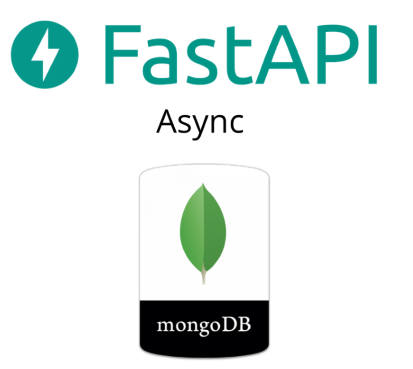

# FastAPI MongoDB Async RestAPI

### A Blueprint of a production-ready project.



> This project is based on [Michaldev](https://github.com/michaldev)'s Github [fastapi-async-mongodb](https://github.com/michaldev/fastapi-async-mongodb).</br>
> Headers, tokens and other security features has been ignored for simplicity.
> How to setup a [local Mongodb](https://zellwk.com/blog/local-mongodb/) for testing purposes.

# Features:

- Framework: [Fastapi](https://github.com/tiangolo/fastapi)
- DB: [MongoDB](https://github.com/mongodb/mongo)
- dependencies:
  - [Pydantic](https://github.com/samuelcolvin/pydantic)
  - [Motor](https://github.com/mongodb/motor)
  - [uvicorn](https://github.com/encode/uvicorn)
  - [sentry](https://github.com/getsentry/sentry)
  - [prometheus](https://github.com/prometheus/prometheus)
  - [tavern](https://github.com/taverntesting/tavern)
  - [Pytest](https://github.com/pytest-dev/pytest)

## Usage:

> Check ./Makefile content to understand how to run the app manually.

- [Makefile](https://www.gnu.org/software/make/manual/html_node/Simple-Makefile.html):
  - `make run_pytest_venv # run tests from a virtual environment (.venv)`
  - `make run_docker_dev # create and run the api from ./docker/Dockerfile.dev`

## Project Structure:

```
├───api
│   ├───db          # db connection and mongodb api
│   ├───models      # pydantic models
│   ├───public      # public api namespaces
│   │   ├───health  # health check
│   │   └───user    # CRUD endpoints
│   └───utils       # app utilities
│   │   └───logger  # custom logger
│   └───config.py   # app config
│   └───main.py     # app main
├───docker          # dockerfiles
├───requirements    # dependencies
└───tavern_tests    # api tests
└───entry_point.py  # app entry point
└───Makefile        # commands helper
```
